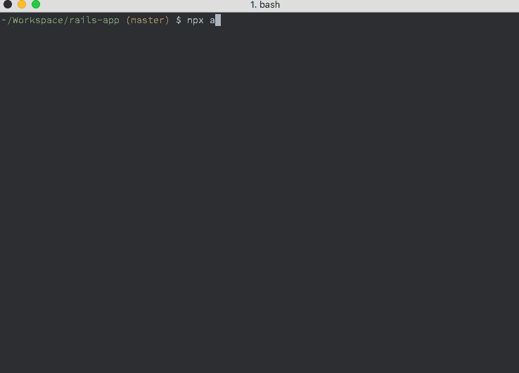

# auto-rollback

[](https://travis-ci.org/darwintantuco/auto-rollback)

Custom `post-checkout` git hook to auto rollback new migrations on git checkout

`git config` is used to set rollback status

Backup existing `post-checkout` hook



## Supported Apps

rails

## Getting Started

### Requirements

npm >= 5.2.0

bash

## Usage

#### Enable auto migrate on git checkout

```bash
$ npx auto-rollback enable
```

#### Disable auto migrate on git checkout

```bash
$ npx auto-rollback disable
```

#### Show rollback status

```bash
$ npx auto-rollback status
```

## How auto rollback on rails work?

After `git checkout`:

1. Execute `git checkout <previous-branch> db/migrate`
1. Get migration versions
1. Execute `bundle exec rake db:migrate:down VERSION=<version>` for each version
1. Undo all changes in `db/migrate/` and `db/schema.rb`

The flow will be less complicated if `pre-checkout` git hook exist

### Note

- Assumes all migration are reversible
- `bundle exec rake db:migrate:down VERSION=<version>` fails silently

## License

MIT
